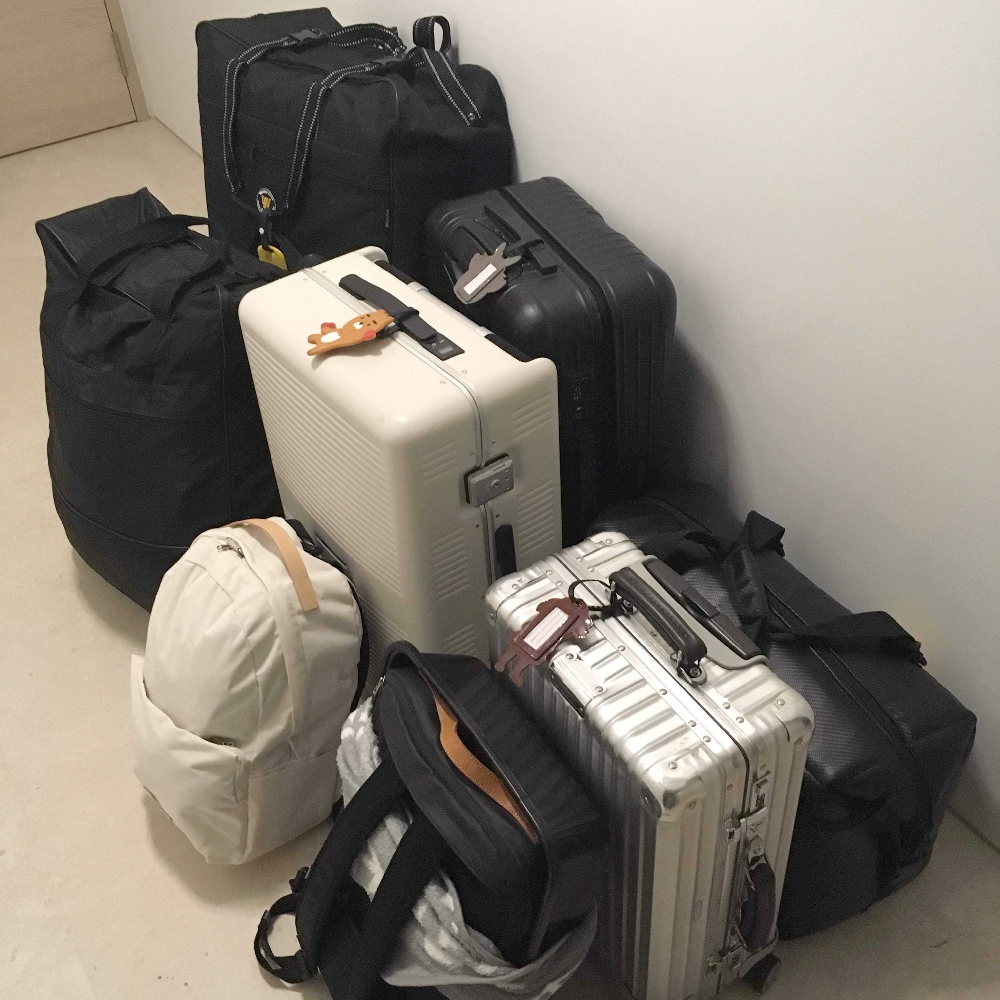
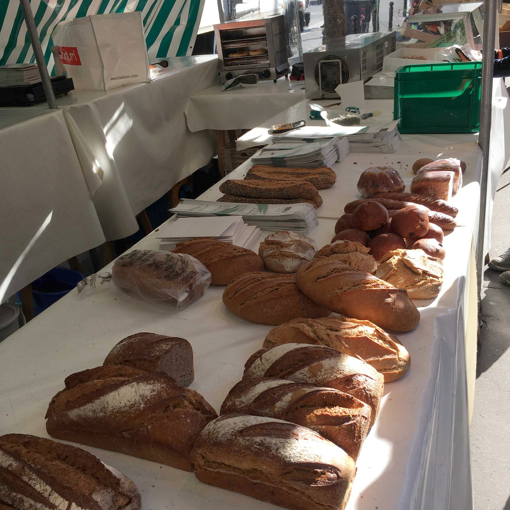
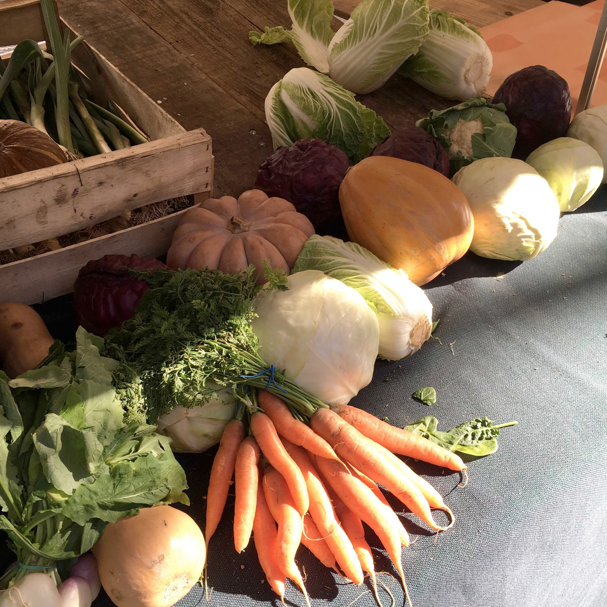

For the entire my life, it was the year where the most changes happened to me. It was fresh, and also overwhelming.

## Arrival

I arrived at Charles de Gaulle airport at 6 AM on 2nd February 2019. The international moving was tough. My wife and I carried:

- Two giant items of luggage
- Two big items of luggage
- One small luggage
- One icebox
- Two backpacks

They were about 100 kg. Ah, and plus one cat (4.5 kg). We were so tired of carrying all those and flying for 14 hours, making sure our cat is doing okay.

Waiting for a taxi, I felt cold. It was good. I lived in Singapore for two years of summer, which was near the equator. It reminded me of the fact that now I'm again living in a country where there are four seasons like in Korea.

I got a job as a software engineer at a company named Algolia. I loved their product and their culture looked amazing. My wife, who used to be a designer, was getting more interested in cooking. So, for both of us, it was very exciting to move to Paris.

## Settling down

Talking to realtors over the phone who don't speak English, getting an apartment, backpack and passports stolen, opening a bank account, etc. Nothing was easy. I can talk about this for hours. But not now.

## Algolia

I have worked mostly in Korea. Even when I was in Singapore, I worked for a Korean company and mostly with Korean colleagues.

I joined Algolia in March. It was my first time being in a non-Korean company with almost no Korean colleagues at all. Nothing was familiar. Everything around me was different.

The country where I live has changed. My life has changed. The working environment has changed. My tech stack at work has changed. My work language has changed. It was quite stressful to catch up with all the things. Even though I went through all that, I've been very happy at Algolia. I'm learning a lot. I like the culture. I like this opportunity.

## English

English was the biggest trouble. When I was in Singapore, I used English with a sales guy, but all the developers were Korean. I didn't use English much at work.

I joined Algolia. I went to work at 10 am, and only an hour later, my English battery became 10%. For the first couple of months, it was really hard. I thought:

> My English sucks. I'm so not ready to work in English, but I'm already here. What do I do?
As time passed, I've come to break down the problem into many pieces.

1. Yeah, my English sucked. It was true. There was a huge room to improve. I needed more practice.
2. I was not used to the French accent. When they pronounce things differently, my brain suffered a lot to figure out what they meant.
3. I had never heard people saying out loud all those technical words. It took time to get used to the pronunciations.
4. When American colleagues start speaking fast, it's super fast. I'm getting better at it.
5. If I don't interfere, a chance to talk is never given. It took me some practice and courage until I became able to interfere in English.

Now it became a bunch of smaller issues, and I was able to tackle them one by one. I'm still working on my English. I still get embarrassed from time to time. But, the important part is I think my English is much better than a year ago. I'm much less uncomfortable.

## Social activity

I'm not a people person. I love spending time at home with my wife. I was happy with the way I was. However, it was not because it was well-balanced, but because it was just easier for me. I knew I needed more social encounters. Moving to Paris, I decided to try more. Indeed, I've been throwing myself into crowded places more than before, but not enough to burn me out. I'm definitely out of my comfort zone. I've been kind of enjoying this weird mix of uncomfortable feelings and excitements. I think I'm going towards the balance.

## Asking questions

At Q2 peer review, one of my colleagues said I needed to ask questions earlier than I was doing. In his point of view, I took too much time until asking. I was surprised. I thought I asked early enough.

In Korea, asking questions is considered harmful. Sounds stupid? Yes. Even there is a lame joke against people asking questions. However, as a misfit/rebel in Korean society, I have asked questions a lot. I bothered people a lot. But before asking, I took time to organize my thoughts and make clear of what I understand and what I don't understand. I guess he thought it was too long.

After the feedback, I decided to try to ask earlier. Even when I thought I wasn't ready to ask a question because I wasn't aware of the whole context, I just asked. And it worked fine. Unexpectedly, people proactively helped me understand things. At Q3 peer review, I got positive follow-up feedback on it.

It was an unexpected lesson.

## New food

I love food but obviously, I have things that I don't like, or at least I thought I didn't like. After moving to Paris, I have been revisiting those things and there have been lots of changes. I liked only soft bread whereas my wife loves all kinds of bread. Even the baguette was too hard for me. Now? When my wife asks me to buy a baguette on my way back home, I always bring it home without the tips.

Mustard for me used to be artificially yellow, sweet and weird sauce which I never liked. After trying mustard here, I found it different. It has a little spicy kick and it's very refreshing. I love mustard now. No, I should say "j'adore moutarde".

## French

Thanks to Algolia, I've been having French class once a week during working hours. I'm still struggling at the elementary level, but at least I can speak basic sentences in the market to buy eggs, beef, etc. Algolia also provides both English and French classes to my wife Minji. Her English has improved a lot, compared to a year ago when we lived in Singapore.

## Better code

The way I coded was partially old-fashioned and there were new patterns that I hadn't caught up. This year I learned really a lot from my colleagues. They gave tons of feedback on my code. It helped me grow. Every day I'm learning from them. My code isn't good enough but I know it's better than a year ago.

## Working with many people

Before Algolia, I worked for a startup for years with less than 10 people. I mostly talked to 3-4 people daily. Before that, I worked for a pretty big company, but I was a junior and didn't have much chance to work across teams.

Now here in Algolia the product is huge and there are tons of people working on a different part of the product. So inevitably I had to learn to proactively reach out to those I need and to work with them. This was something new. It was awkward at first but I'm feeling more comfortable.

## Ship.js

*(*[*View GitHub →*](https://github.com/algolia/shipjs)*)*

I cannot skip this part. I came up with an idea and worked on it during the off-sprint which is like a hackathon where at Algolia we spend a day every month to do whatever we want to try out. I got drawn into it. I spent lots of my personal time, too.

I guess I couldn't build it without what I've learned since I joined Algolia. Luckily many people found it interesting. The GitHub repo has about 450 stars now. There are four contributors working with me.

## 2020

I have no idea what's coming in 2020. I'll just keep doing my best. I can say now I have settled down here. I have fewer chores to do and I can better focus on things. It means I will be more productive and also I will enjoy life here in Paris and hopefully travel more.

