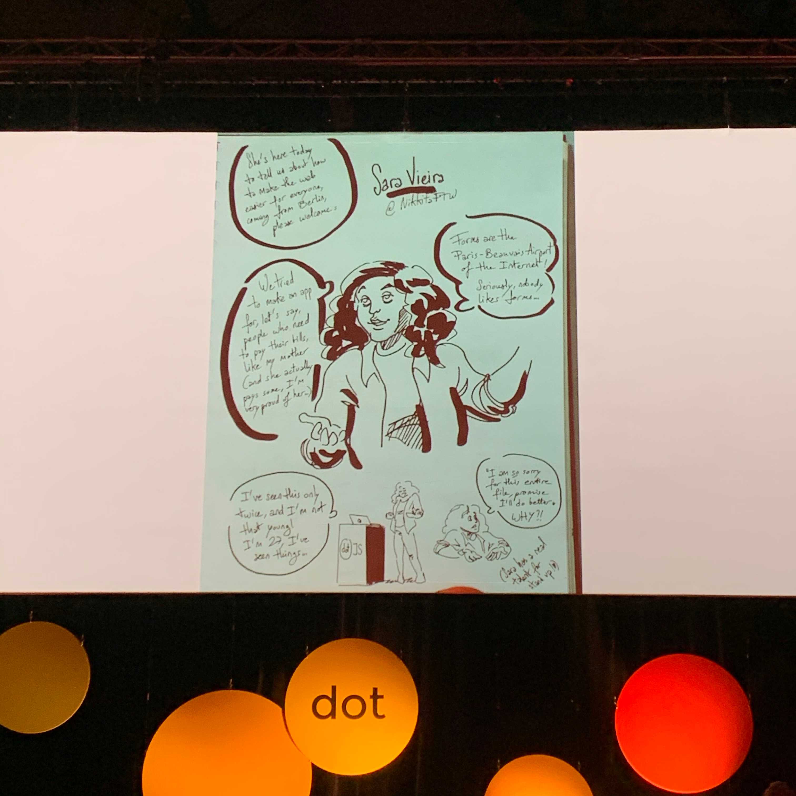

## Going there

I went to dotJS 2019 for both days(5th to 6th). I thought it might be good to write down what I felt during the days. For your information, this is not going to be a summary of the talks.

When I was in Korea, I barely went to conferences. I probably did once or twice. The biggest reason was because I don't like being in crowded places. I cannot stand the active social encounters and the pressure that I feel like I have to consistantly talk to people like they seem to be doing.

There is another reason. In Korea, the technical trend is relatively slow. When there is something new, some people get the news from Twitter, YouTube, blogs, etc, but the most of people don't care much until the materials are translated into Korean and spread broadly. When I went to conferences a few times in the early days of my career, they were mostly translated version of what I already learned online like months, or even a year ago. Because of that experience and my introvert traits, I didn't go to conferences afterwards.

Now I live in Paris. dotJS 2019 was held in Paris. I don't need any flight or accomodation and even my company(Algolia) pays for my ticket. And to me, the speakers are like super stars on Twitter. I got interested. I didn't like being in a massive crowd but I had to be there.

Luckily the talks were interesting enough to help me stand the social awkwardness. They were inspiring with new ideas and experiments. Yes, that's what I came for!

## Drawings

During the breaks, they displayed drawings of the talks. It was done by [Florine Pigny](https://twitter.com/FlorinePigny). During the talks, she drew those simultaneously. It was such a nice and creative way to capture the moment that I've never thought about. Fresh.

## Theater

During the conference, I learned a thing. When you go to a theater, you cannot pause the movie whereas you can do it on Netflix. I realized it's the same in conferences. I was kind of forced to listen to all the talks regardless of my interest. It helped me explore broader aspects of things.

## Chris Heilmann

And I saw Chris Heilmann.

> And I saw Chris Heilmann.

This may sound weird to you. It's not like I'm a huge huge fan, but he's a legend, right? For me, it was just another moment that I realized I have moved to an environment where I can get to meet those people. South Korea is surrounded by sea and North Korea. It's practially an island. It's far from western countries. I couldn't go to USA or Europe for conferences and those big people normally don't come to Korea(Maybe they did but I just didn't know). Now I live in Paris and everything is more accessible. So it was kind of unrealistic for me to see him in person.

## Tweets

These are two threads of tweets I used as a memo for two days.

### Day #1

[Eunjae Lee on Twitter](https://twitter.com/eunjae_lee/status/1202499063893151749)

### Day #2

[Eunjae Lee on Twitter](https://twitter.com/eunjae_lee/status/1202879678744342528)

## Next

It was still hard to be in the crowd. It was better when I was talking with someone than when I was wandering alone. I was wearing Algolia hoodie and people often came to me to talk about Algolia. It was good. It definitely made things easier for me. Ever since I moved to Paris, I've been trying to be less introverted. I think it's getting better. I'm not trying to become someone who I am not. I'm just trying to get out of my comfort zone a little. I hope it'll be easier next time.

