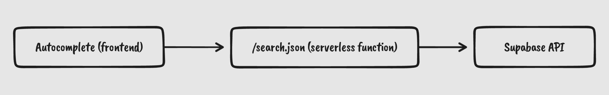

I've implemented Full Text Search feature on my side project [Quill](https://quill.so). Although I have a bit of experience(as in *I work there*) in Algolia, I didn't use Algolia at this time. Algolia is the most powerful Search-as-a-service out there, but for this small side project, I don't need that power yet. Also, I already have all the data stored in Supabase, and could just simply start using the search funcitonalities of PostgreSQL.

For the UI part, I could've used a simple `<form>` and `<input>` but instead went with Algolia's Autocomplete library, which provides a great accessibility including keyboard navigation out-of-the-box.

[Full Text Search | Supabase](https://supabase.com/docs/guides/database/full-text-search)

[GitHub - algolia/autocomplete: 🔮 Fast and full-featured autocomplete library](https://github.com/algolia/autocomplete)

I have a table `posts` with attributes including `title` and `body`. For now, I've decided to call two separate search calls, one for `title` and another one for `body`. I do not want to mix results, so that I can prioritize posts matched with `title` to be listed first.



The image above shows you the flow from the frontend to the backend. I don't have much to explain, so here are some snippets for you.

The frontend component ↓

```html
<div id="autocomplete" />
```

```javascript
import { autocomplete } from '@algolia/autocomplete-js';
import '@algolia/autocomplete-theme-classic';

// To learn more about debouncing with Autocomplete,
// Read https://www.algolia.com/doc/ui-libraries/autocomplete/guides/debouncing-sources/
function debouncePromise(fn, time) {
  let timerId = undefined;

  return function debounced(...args) {
    if (timerId) {
      clearTimeout(timerId);
    }

    return new Promise((resolve) => {
      timerId = setTimeout(() => resolve(fn(...args)), time);
    });
  };
}
const debounced = debouncePromise((items) => Promise.resolve(items), 300);

// I use two sources, one for search results on `title`, and another one on `body`.
// The code is almost the same, so I extracted it as a function.
const getSource = ({ sourceId, mode }: { sourceId: string; mode: string }) => ({
  sourceId,
  onSelect({ item }) {
    window.location.href = `/${item.slug}`;
  },
  async getItems({ query }) {
    const response = await fetch(
      `/search.json?mode=${mode}&query=${encodeURIComponent(query)}`
    );
    const json = await response.json();
    json.result.forEach(({ slug }) => prefetch(`/${slug}`));
    return json.result;
  },
  templates: {
    ...(mode === 'title'
      ? {
          noResults() {
            return 'No result for this query.';
          }
        }
      : {}),
    item({ item, createElement }) {
      return createElement('div', {
        dangerouslySetInnerHTML: {
          __html: `
              <div class="aa-ItemWrapper">
                <div class="aa-ItemContent">
                  <div class="aa-ItemContentBody">
                    <div class="aa-ItemContentTitle">
                      ${item.title}
                    </div>
                    <div class="aa-ItemContentSubtitle">
                      ${item.excerpt}
                    </div>
                  </div>
                </div>
              </div>
              `
        }
      });
    }
  }
});

// The real Autocomplete part.
autocomplete({
  container: '#autocomplete',
  placeholder: 'Search',
  autoFocus: true,
  getSources() {
    return debounced([
      getSource({ sourceId: 'postsByTitle', mode: 'title' }),
      getSource({ sourceId: 'postsByBody', mode: 'body' })
    ]);
  }
});
```

/search.json ↓

```javascript
// The way to write serverless function varies according to platform.
// So this is the minimum business logic, excluding all the platform-related code.

function quote(s: string) {
	return "'" + s.replace(/'/g, `\\'`) + "'";
}

const searchQuery = query.get('query');
const mode = query.get('mode'); // 'title' | 'body'

const quotedQuery = searchQuery
  .split(' ')
  .map((word) => quote(word))
  .join(' & ');

const targetAttribute =
	mode === 'title' ? 'searchable_title' : mode === 'body' ? 'searchable_body' : null;

const { data } = await supabase
	.from<Page>('pages')
	.select('slug,title,excerpt')
	.textSearch(targetAttribute, quotedQuery)
	.eq('project_id', projectId);

return {
	body: { result: data },
}
```
