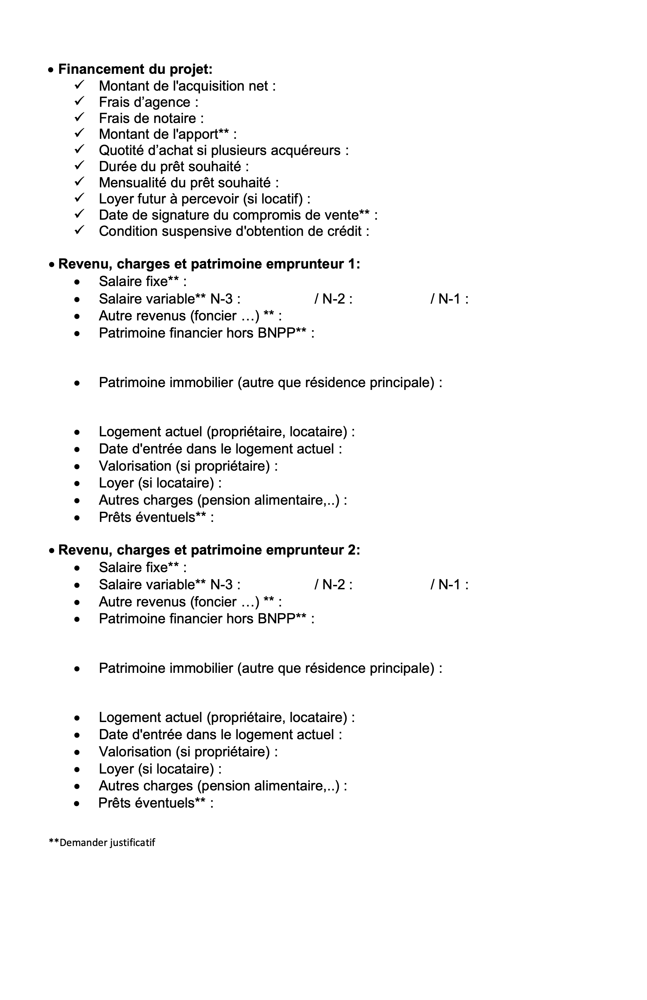

I've contacted my banker (I'm using BNP Paribas) to ask questions about purchasing a house and borrowing money for that.

She sent me this form, so I filled it in and sent it back to her.

I haven't heard from her yet. And I need to compare the conditions with other banks too.

Banks to contact:

- Boursorama (They have a [simulator](https://www.boursorama-banque.com/credits/))
- I should probably use a broker to get the best rate.

