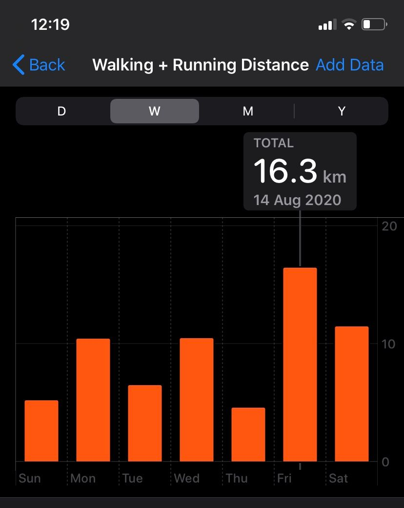

> Why don't we buy a house? That's what we have been dreaming of.

My wife triggered this question and we got into it. We had no idea even if it's feasible or not because we're living in a foreign country and there are so many things that we don't know about. One thing led to another and here we are. We put an offer on a house and the owner has accepted it. All we have now is a long journey of prepping documents and getting a loan from the bank.

## 👩 Her part

When it comes to things like this, each of us has very distinct roles and responsibilities. My wife who used to be a designer has a great set of eyes and an organization skill of Monica Geller. She searched for suburban cities and list them down. She searches for transportation from the city center to Paris. She checks the reviews about the city on [ville-ideale.fr](https://www.ville-ideale.fr/). And she goes to [seloger.com](https://www.seloger.com/) and searches for houses and apartments in those cities. Normally there are 4-5 photos per property poorly taken by realtors but surprisingly she captured very important points about the properties from the pictures.

> Look at this corner of the picture. This house has this and that problem in the kitchen. You'll see what I mean when we visit here.

Without exaggeration, she has checked about 1,000 properties on [seloger.com](https://www.seloger.com/) and filtered down to 92. She sent messages to those 92, mainly saying "I am interested but I don't speak French, so please send me SMS so that I can use Google Translator".

Whenever she sent a message to a property, she put it on [airtable.com](https://airtable.com/) with some information including "rates", ranging from 1 to 5 stars.

## 👨 My part

Then I made phone calls to them because they don't just send me messages diligently. Whenever they reached back to me, I save the contact with " - " format. That's what we use to identify when we talk about properties.

I tried to make appointments geographically adjacent in each day. We intensively spent a little longer than two weeks. Sometimes we viewed 4 houses in a day. During the 11 days, we walked for about 118 kilometers.

## 🍀 Budget

We preferred a house but keep an eye on apartments too. Our budget was 350k euro and was not easy to find houses which doesn't require much of renovation.

## 🌊 92 properties

- Chatou: 2 apartments and 1 house
- Chaville: 2 apartments
- Colombes: 4 apartments and 1 house
- Cormeilles-en-Parisis: 3 apartments and 3 houses
- Courbevoie: 1 apartment
- Eaubonne: 2 apartments and 5 houses
- Épinay-sur-Orge: 1 house
- Ermont: 3 apartments and 7 houses
- Garches: 2 apartments
- Joinville-le-Pont: 1 apartment
- L'étang-la-Ville: 2 apartments
- Maisons-Laffitte: 2 apartments
- Marley-le-Roi: 4 apartments
- Montmorency: 1 apartment
- Nogent-sur-Marne: 3 apartments
- Noisy-le-Grand: 5 apartments and 5 houses
- Saint-Maur-des-Fossés: 1 apartment
- Villennes-sur-Seine: 4 apartments and 1 house
- Viroflay: 2 apartments
- Conflans-Sainte-Honorine: 9 houses

## 🌈 Status

- We didn't go: 3
- Visited: 14
- Already sold: 11

## 🚶Visit🚶‍♀️

- Conflans-Sainte-Honorine
- Cormeilles-en-Parisis
- Eaubonne
- Ermont
- Épinay-sur-Orge
- Garches
- Noisy-le-Grand
- Villennes-sur-Seine

## ⭐️ Rating

- ⭐️: 4
- ⭐️⭐️: 27
- ⭐️⭐️⭐️: 35
- ⭐️⭐️⭐️⭐️: 6
- ⭐️⭐️⭐️⭐️⭐️: 1

Surprisingly my wife's rating was very correct.

> Minji: What do you think of this one?

> Me: Umm. This is better than the previous one but less good than the one before.

> Minji: Yeah it's because we're visiting 4-star, 2-star, and 3-star houses today.

And we've got the 5-star house 🏡

## What is it like?

It's a house built in 1964 by a married couple. They gave birth to children and have lived here forever. Their children are now in their 40s-50s. The old couple now has moved out to a smaller place. The children were like

> What do we do with the house? We cannot sell it because it's where we were born and grew up.

But finally, they have decided to sell it and we're going to be the second owner of this house 56 years after its construction. The house is very well maintained. All the wooden ceilings are clean. The floors are quite good. The narrow space under the roof is clean. Even the garage is so clean and not humid at all. No hint of fungus at all. It's not just an old house but a house that has been loved and maintained by someone like my wife. In a certain aspect, the house gives us this feeling that we need to preserve this as if it's a historic building. We won't tear things down so easily. The realtor explained to us like

> This was built in xxx, and this second floor was built when they gave birth to their third kid. They changed these windows in the 1990s, ...

We will continue it and hope the next owner will hear stories like

> The second owner, a married couple from Korea loved this house so much. Check this out. You can see how they cared much.

