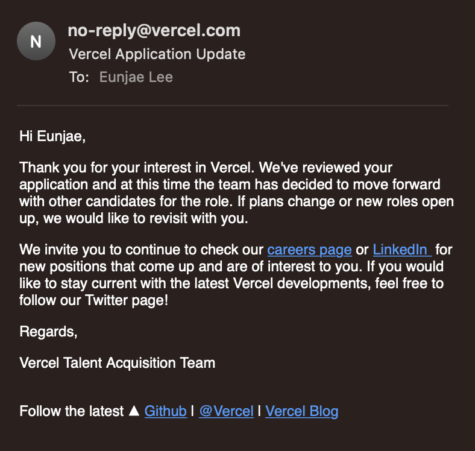

이직을 준비하면서 많은 이력서를 보냈고 떨어졌지만, 그게 자신감에 도움을 주기도 한 거 같아요. 예를 들어,

"와. Vercel 에 이력서를 보냈는데, 서류 탈락했다는 자동 메일을 받아봤어!!!"

"와. 내가 GitHub 에 이력서를 보냈는데, 아무런 답을 못 받았어. 하지만 GitHub 에 지원을 해보다니!"

마냥 나와는 거리가 먼 것 같은 회사여도, 실제로 어느 정도로 먼지 거리감을 알 수 있게 되는 것 같아요.

물론, 채용이라는 게 양쪽 모두에게 운, 타이밍 등의 컨트롤할 수 없는 부분이 있지만, 그럼에도 불구하고 이렇게 실제로 지원을 하고 떨어지는 걸 겪는 것 자체가 기분이 묘하달까요?

이러다가 운이 좋아 1차라도 면접까지 가게 되면, 그게 다음에 또 도전할 밑거름이 되기도 할 테고, 어떤 점을 더 보완하면 좋을지 힌트를 얻을 좋은 기회도 되는 것 같아요.

"no-reply" 인 게 약간 마음 아팠었지만 ㅎㅎ

그래도, 도전의 흔적 같아서 기분 좋더라구요.

https://twitter.com/eunjae_lee_ko/status/1570511994675134464
