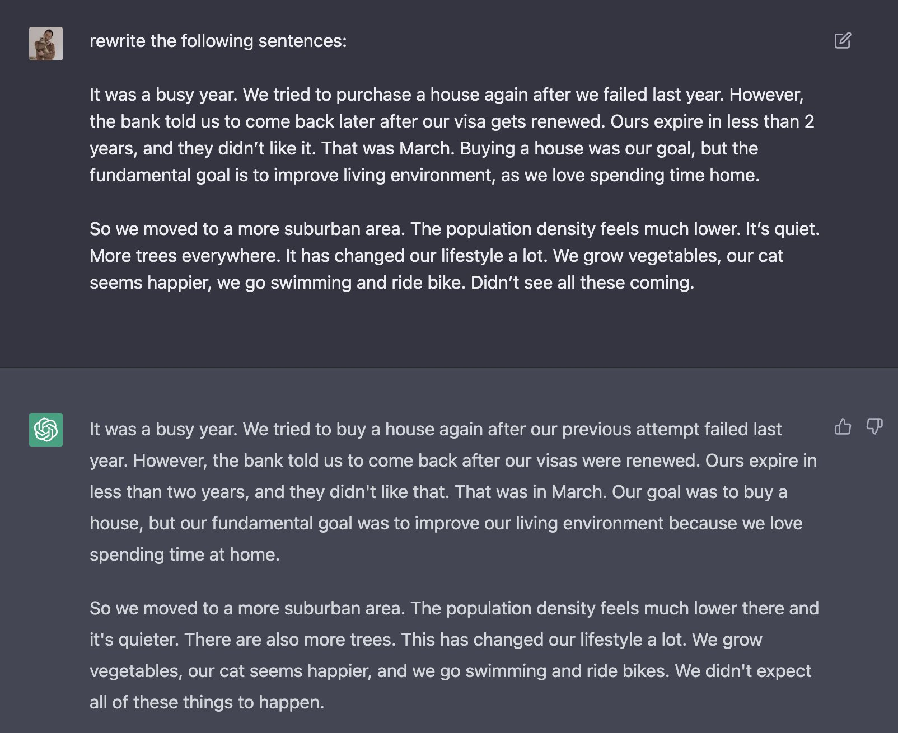
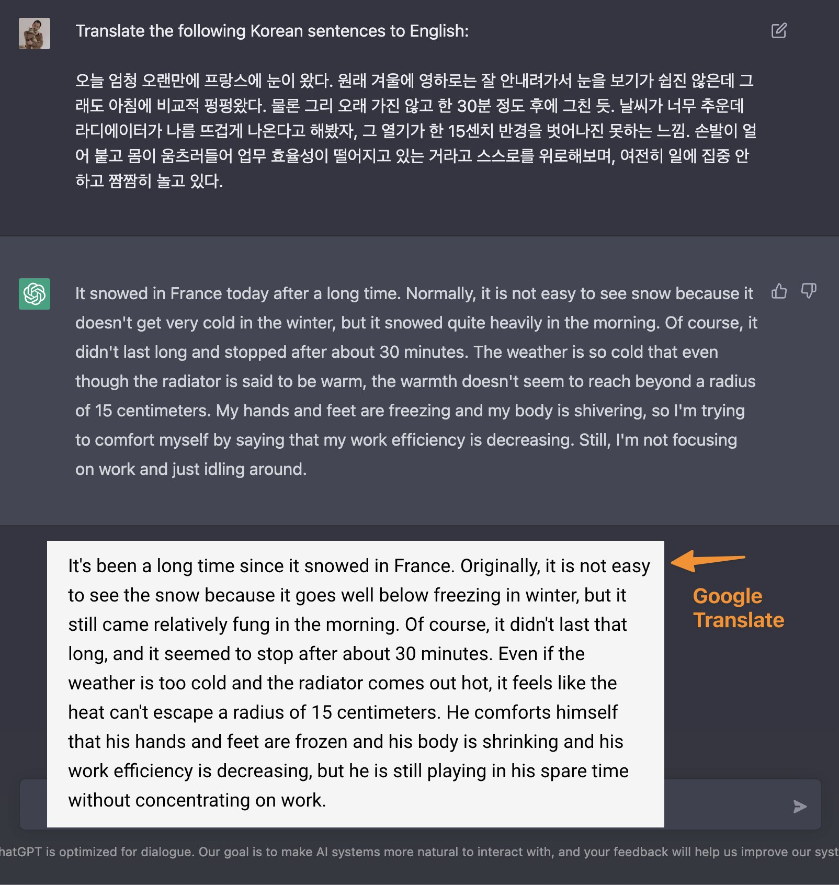

앞으로 영어 쓰기 점점 더 쉬워지겠네요! 예전에 제가 썼던 블로그 일부를 한번 다시 쓰게 시켜봤는데, 진짜 많이 다듬어지네요. 애초에 저 포스트도 Grammarly 를 한번 거친 결과거든요?

Grammarly 가 말 그대로 문법 수준으로만 교정해줬다면, ChatGPT 가 좀더 영어스럽게 바꿔줬어요.

구글 번역기의 참패..?!

https://twitter.com/eunjae_lee_ko/status/1599700960338935809
