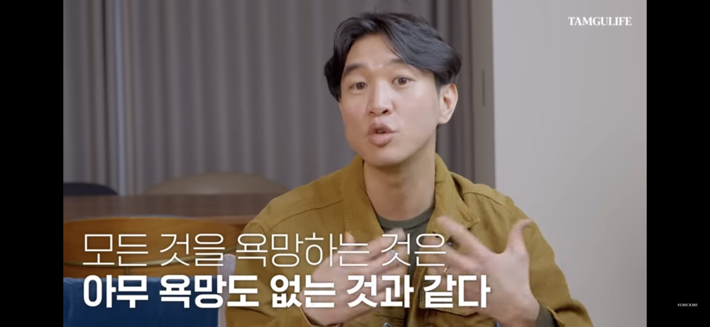

조승연 작가 채널에 에에올 해설 영상 봤는데 좋았어요.

요즘 세상에 모두가 모두의 삶을 자기 삶 들여다보듯 현미경 수준으로 자세히 보는 게 너무나 쉽다보니, 남의 삶을 욕망하기 너무 쉬운 거 같은데, 그 욕망의 대상도 한 둘이 아닌 듯.

그러다보니 내 삶을 제외한 모든 삶을 다 욕망하다보니 결국 아무 욕망도 없는 허무주의로 빠진다. 대강 그런 설명이었는데,

그럼 내 욕망의 초점은 어디로 맞춰야 할까? 좀 고민해보게 되네요 🙂

(몇 개 떠오름)

https://www.youtube.com/watch?v=tP0xrERvEp8

https://mobile.twitter.com/eunjae_lee_ko/status/1631777774175150081