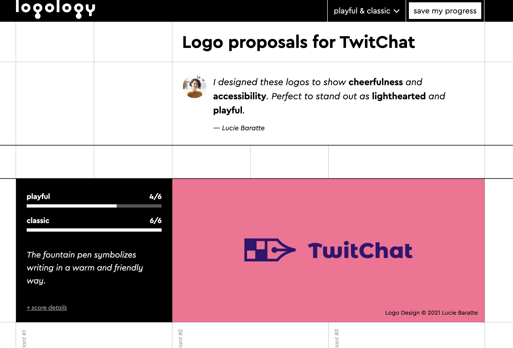
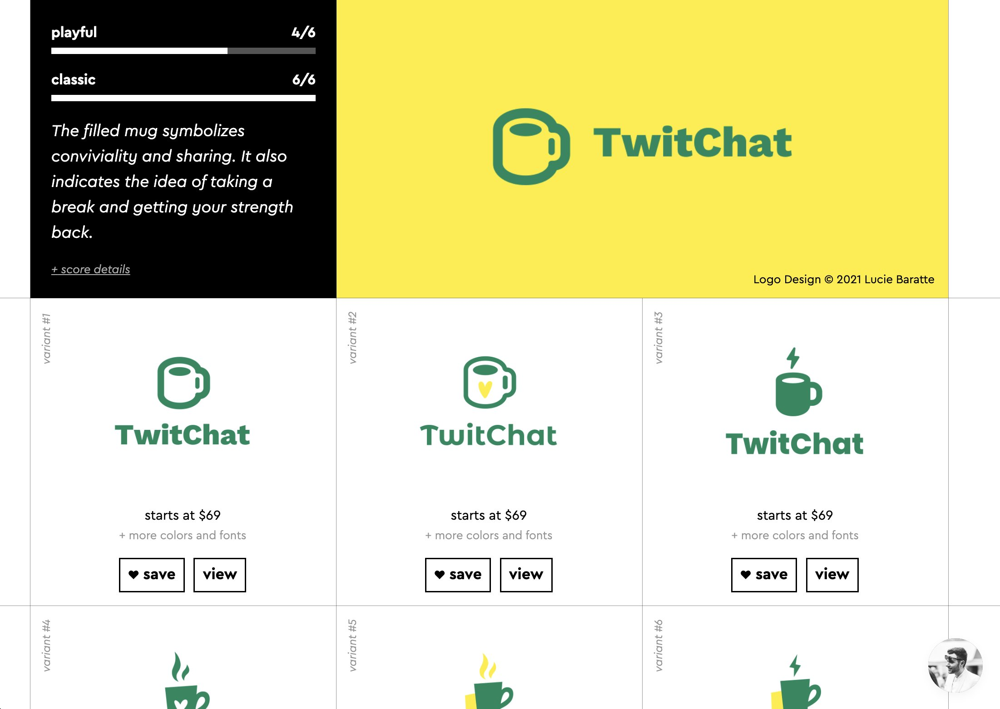
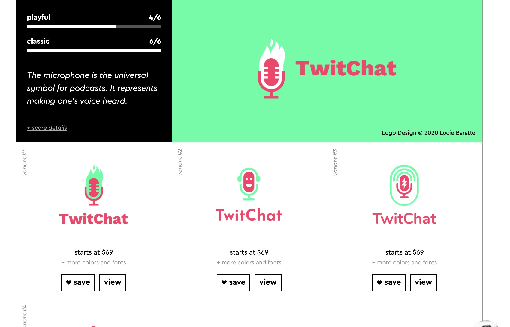

Logology 라는 서비스를 발견했는데 좋아보여서, 미래의 저를 위해서라도 한번 트윗으로 남겨봅니다.
로고를 만들기 위해 총 15개의 객관식 질문에 대한 답을 하면서 프로덕트 내지는 회사의 성격을 진단하고 그에 맞는 로고를 다양하게 보여주고, 결제할 수 있게 해주네요.

https://www.logology.co/

자세히 대답하기 귀찮아서 객관식을 적당히 빨리 넘기긴 했지만 그래도 꽤 비슷한 결과가 나와서 재밌었어요.
엄청 많은 variations 이 있어서, 그 중에 고르면 됩니다!

아 참고로, 이런 서비스가 참 많고 많은데... 정말 낮은 퀄리티에 양으로만 승부하는 곳이 많거든요. 여기는 설문이 꽤 결과를 narrow down 하는 역할을 잘 해주는 것 같고, 유료라는 점에서 오히려 더 마음에 드네요.

https://twitter.com/eunjae_lee_ko/status/1557653074730258432