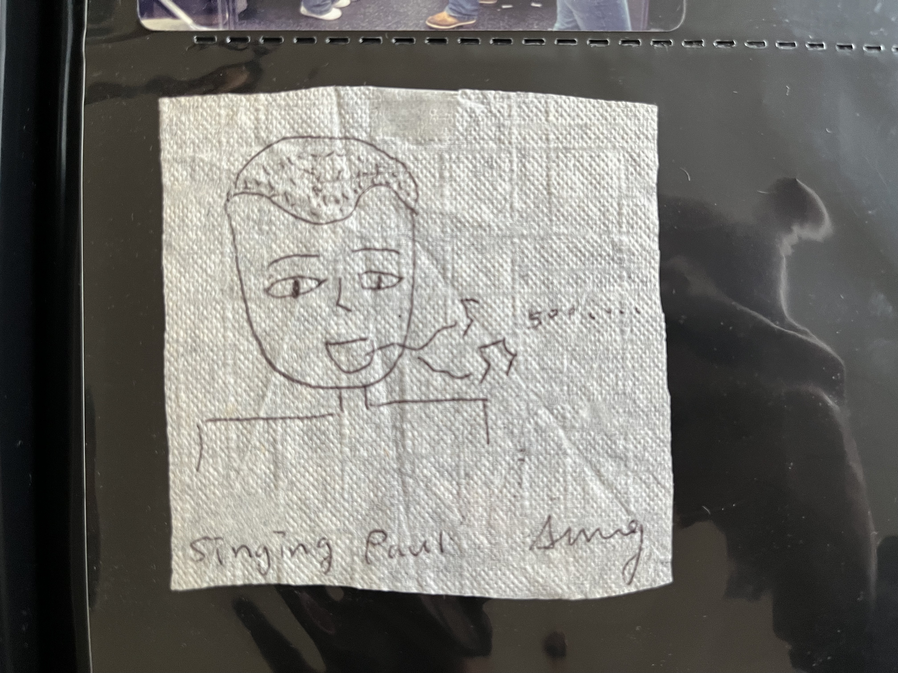
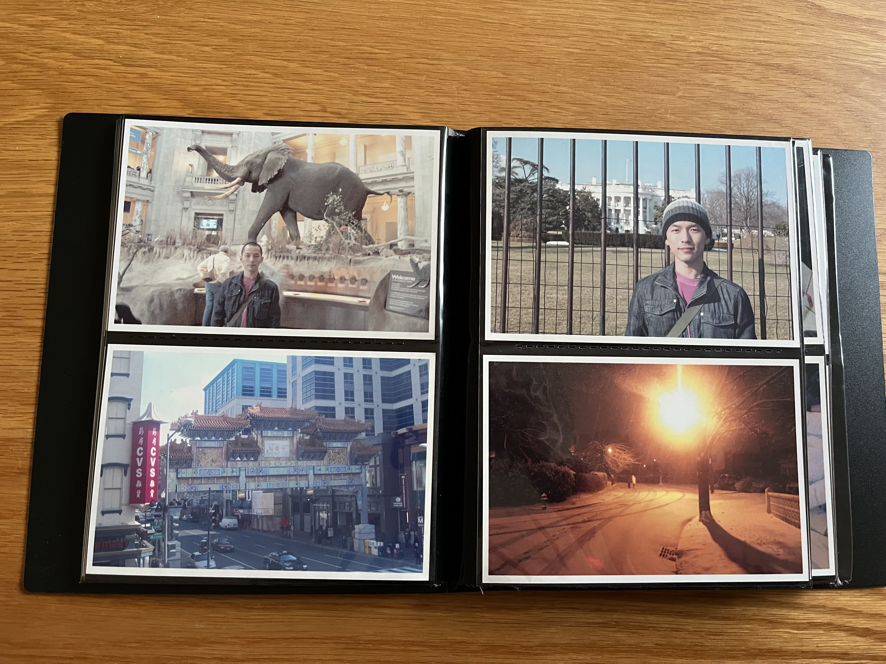
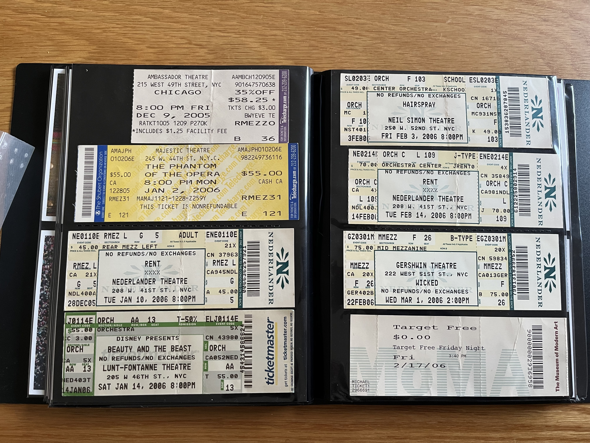
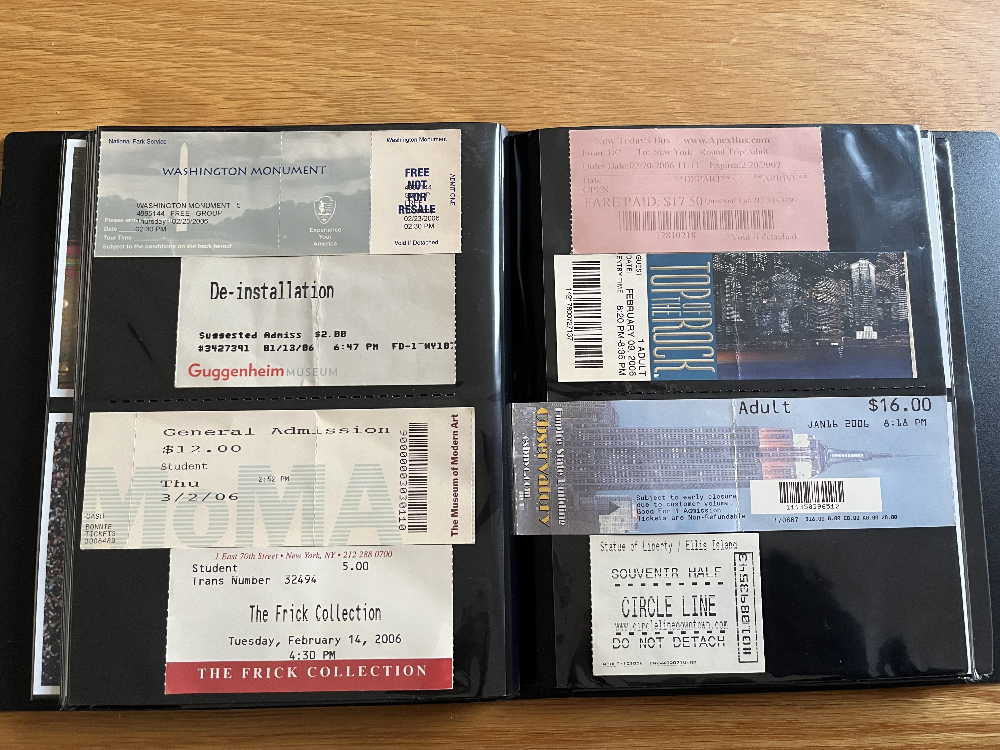
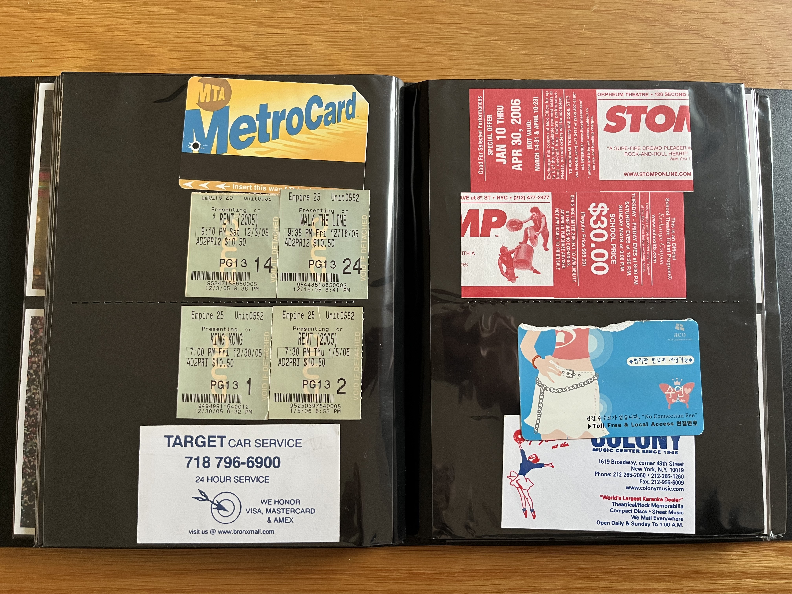
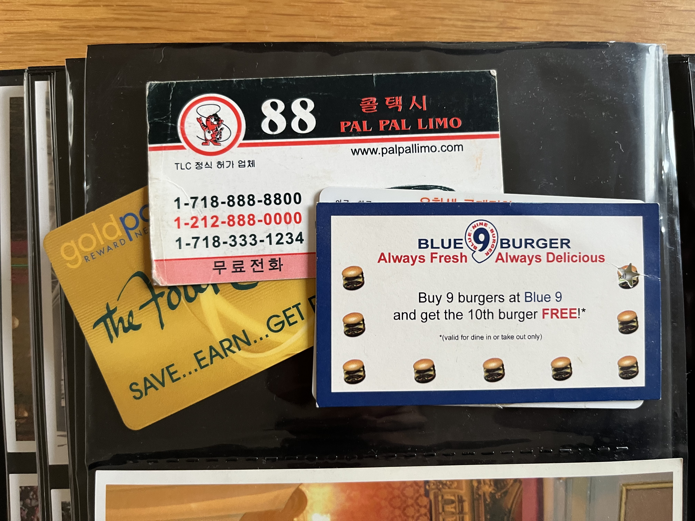
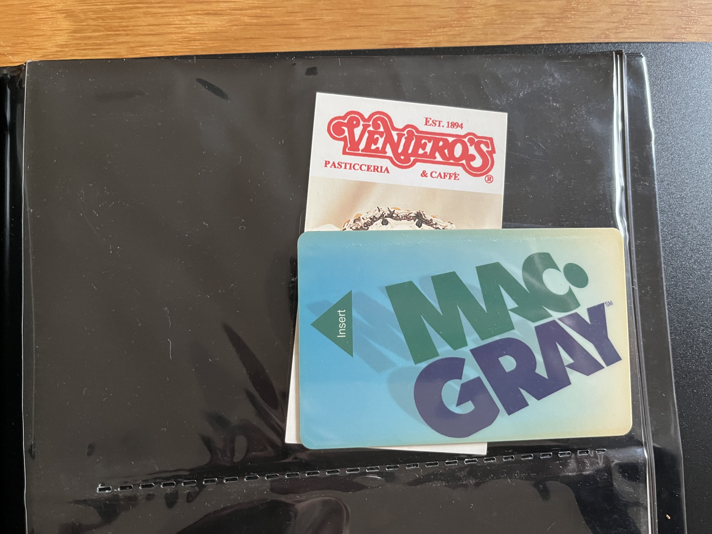
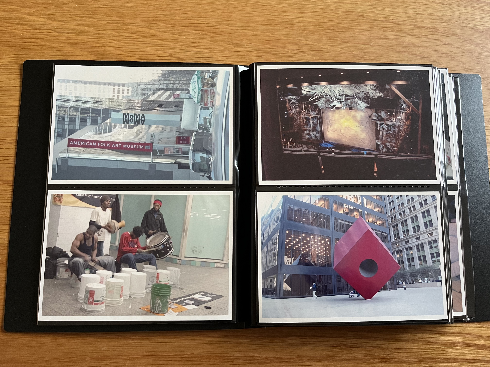
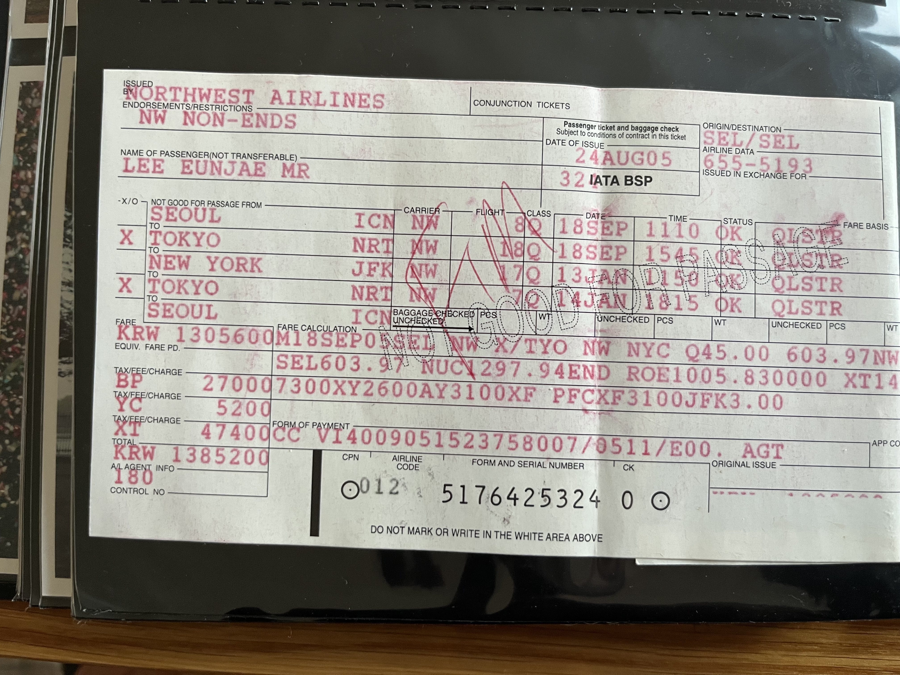

스물한 살 때 어학연수 뉴욕에서 6개월 보냈었는데, 난생 처음 가족과 떨어져 살아보고 + 해외에 나가본 거라 정말 모든 게 새롭고 즐겁고 자유롭고 행복했음.

나중에 한국 돌아와서도 몇달에 한번 꼴로 다시 뉴욕 돌아가는 꿈 꿨음. 공항으로 급하게 뛰어간다던가, 기숙사에서 잠이 깨는 그런 꿈을 자주 꿨고, 그 후에 엄청 슬펐음.

친구랑 맨하탄 시내에서 만나기로 하면 한시간 정도 일찍 나가서 스벅에 가곤 했음. 한 2.5 달러 정도면 카페 모카 적당히 큰 걸 시킬 수 있었던 걸로 기억하는데, 그거 홀짝 거리면서 책 읽거나 당시 아끼던 PDA 에다가 일기 내지는 메모를 하루에도 십수번씩 적으며 보냄.

싼 가격에 공간을 사용할 수 있고 적당히 허기도 채워주는 카페 모카가 좋았음. 그 때 그냥 스벅이 난생 처음이었는데 같이 간 사람이 내가 뭐 시킬지 몰라 하니까 그냥 이거 먹어보라 하고, 난 6개월 내내 카페 모카에 푹 빠져서 그거만 마심 ㅎㅎ 지금은 먹으면 속이 뒤집어져서 추억의 음료가 됨..

(참고로 이 타래는 시간 상관 없이 떠오르는 대로 마구 적어보는 기억의 조각들임)

6개월 마치고 한국 돌아가는 비행기 타려 이른 새벽 JFK 공항에 체크인 데스크 줄 서 있는데 내 앞에 서 있는 사람에게 괜히 말을 걸어 봄. 어학원 바깥 바운더리 사람과 대화를 나눠보고 싶었나 봄.

근데 정말이지 이 사람 말이 미친 듯이 빨라서 한 10% 밖에 알아듣지 못하고 그렇게 내 어학연수는 '난 뭘 배운거지'하는 좌절로 마무리 지어짐ㅋㅋㅋㅋㅋ

좀 슬펐던 건, 비행기가 이륙하는데 '아 진짜 끝이구나. 이 땅은 평생 다시 못올 가능성이 높겠지.' 마치 감옥에 끌려가는 죄수의 기분이었음.

결국 뉴욕 떠난 지 10년 후에 짝꿍이랑 신행 코스에 무리하게 뉴욕을 껴 넣어서 다시 감! 신행 2주로 길게 가서 유럽 2개국 + 뉴욕 해서 지구 한바퀴 돌고 옴.

아 지금 뉴욕 추억이 팡팡 터지는 이유는 며칠 전에 본 Rent 와 오늘 본 틱틱붐의 여파인 듯

어학원 선생님이자 개인적으로도 친하게 지냈던 20대 중반 남자 선생 John 이 있었는데, 맨하탄에서 공중전화로 전화를 걸어서 일루 나올래? 같이 놀래? 라고 말하려 함. 근데 걔가 내 "맨하탄" 발음을 못알아 들음.

```
존: 어디라고?
나: 맨하탄?
존: 응?
나: 맨↗️하탄
존: ??
나: 맨하↗️탄
존: ??
나: 맨하탄↗️
존: ??
```

억양을 모든 위치에 다 넣어봤는데 못알아들음ㅋㅋㅋ쿠ㅜ 결국 스펠링을 쭉 읊음...

```
존: 아~~~~ 맨핫↗️은~↘️
나: (뭐야... 그게 그거구만...)
```

어학원에서 알바 구한다길래 지원함. 별건 아니고 매달 들어오는 신입생 오리엔테이션 자료를 복사하는 일이었음. 뭐 한 60페이지 양면으로 인쇄되어 있는 걸 복사해야 하는 거임. 근데 약간 챌린징한게, 그 60페이지가 대강 기억으로 3-4 챕터로 나뉘어 있고, 각 챕터마다 쓰이는 종이색이 달랐음.

첫 챕터는 분홍 A4, 다음은 파랑, 뭐 이렇게.

복사기가 3대인가 있었고, 이래저래 복사를 하다보니.. 복사기 한대가 일을 안하는 경우가 있음을 발견함.

아.. 내 workflow 가 뭔가 비효율적이구나. 복사기들에 다운타임이 생기면 안되는데.

이렇게 저렇게 순서를 바꾸고 머리를 굴려보니 모든 머신이 풀가동하기 시작함. 그리고 원래 나에게 주어졌던 미션.. 수치가 기억 안나는데 아무튼 n부를 복사해놓으랬는데 그거 2.5배 정도를 해버려서 그들이 나보고 다음달에도 해달랬는데.. 뭔가 마스터 해버린 기분이라 의욕이 없어져서 안함

저때가 아마.. 나의 도구에 대한 집착과 도구를 최대한으로 활용하고자하는 집념을 자각하게 된 첫 사례가 아니었을까. 지금도 온갖 자동화를 해보려고 기를 쓰고 덤벼들고 이게 너무 재밌는데 저때도 복사기들과 행복했다..

아는 형이 미용실에 다녀오더니 머리가 더 바보가 돼서 옴. "예쁘게 해주세요~"가 안되고 미용사가 앞옆뒷머리 어떡할지 일일히 다 물어보는데 영어가 안되니 망해버림.

그래서 나는 계속 셀프로 머리를 자름. 손으로 머리 적당히 잡고 가위로 슥슥 자르고. 왁스 대강 바르면 티가.. 나지 많이..

그래도 아무도 뭐라 잔소리 안함. 그래서 그런 엉망 머리 자르기가 더 쾌감 있었음. 그러다 4개월 정도 지난 어느 날, 도저히 귀찮아서 못참겠다! 외치고 기숙사 화장실에서 가위와 면도기를 가지고 삭발을 감행. 내 지루하고 지루한 인생 중 아주 흔치 않은 기행이었음.

당시 술 한방울 안마셔봤었고 마시고 싶은 생각도 없었고 한국인 형들이 마시라고 할 때 거절했었음. 카드 게임 같은 것도 나는 관심이 이상하게 전혀 없었음. 자연스레 형들이랑 관계가 나쁜 건 아니지만 엄청 친하거나 시간을 많이 보내진 않았음. 대신 누나들은 시내로

여기저기 구경 및 쇼핑을 많이 다님. 기숙사에서 술 먹고 스타크래프트하고 카드 게임하는 형들보단 누나들 따라 시내 돌아다니는 게 훨씬 재밌었음. 스벅도 그렇게 처음 가본 거고. 맛있는 식당도 가고, 명소 같은 곳도 많이 가고.

나라마다 학기와 방학 시즌이 조금씩 다르다보니, 어떤 땐 어느 나라 학생들이 많이 오고.. 이런 주기가 좀 있는 듯. 한번은 브라질 학생들이 많이 왔는데, 그 한달 동안은 한국인 형 누나들 거의 안만나고 그들이랑만 놀러다님. 한국인 그룹은 너무 편하지만 너무 결합이 강해서

영어 한마디 안하고 나 뭐하고 있나 싶기도 해서.. 브라질 친구들이 다 영어를 너무 잘했음. 내가 그때 말하기가 조금씩 늘던 시기였는데, 내가 할 수 있는 최고 속도로 막 재잘재잘 대보는데 그 브라질 친구들이 다 알아들어서 너무 신남.

그 한달간 내가 할 수 있는 최선으로 영어를 그들에게 막 뱉아내고 그들은 다 이해하고 받아쳐주고 이러니까 대화의 속도와 양이 어마어마해서 그 한달이 스피킹 제일 달라진 시기인듯..

어학원에서 reading & writing 수업이 있었는데 이게 매일 2시간짜리. 근데 선생님이 수업 들어오면 존 그리샴 소설책 하나씩 나눠주고, "Read." 한마디 하고 한시간을 보냄. 그리고 칠판에 무슨 주제를 적고선 "Write." 한마디 하고 한시간을 보냄. 너무 성의 없어서 항의해야 하는 거 아닌가

학생들 사이에서 불만이 자자했음. 그래도 시험 통과하려면 그 소설을 다 읽고 내용을 알아야 해서 억지로 읽긴 함. 그리고 글쓴 건 첨삭을 좀 해줌. 근데 이해 안가는 거 집요하게 물어보니, 맘에 들었는지 딴 시람들보다 훨씬 길게 첨삭해줌. 아 이 선생님 활용법은 이거구나. 했음.

어떤 형이 몇몇 데리고 극장에 감. 무슨 영화 보러 가는 건지 물어봤고 그 형이 "음악 좋아해? 그러면 이 영화도 좋을 거야." 라고 했고...

그게 바로 내 인생 영화인 Rent 임. 지금도 일년에 평균 한번은 꼭 보고, OST 는 매일 매일 흥얼거리는..

여튼 극장에서 미칠 듯한 전율을 느낌.

그리고 용돈 차곡 차곡 모아 렌트 덕질을 시작함. 극장에 4번 더 가서, 총 영화로는 5번 보고, 그 당시엔 아직 브로드웨이에서 공연하던 때라 뮤지컬로도 3번 봄. 영화 DVD 를 사고, OST CD 도 사고, 악보집도 사고,

Mark 연기한 Anthony Rapp 이 쓴 렌트 관련 에세이인 Without You 라는 책을 샀는데 엄청 두꺼웠지만 내 평생 첫 영어로 된 책을 스스로 사서 끝까지 다 읽은 사례가 됨. 어딜가나 그 책을 들고 다니고 버스 지하철에서 읽으면서 그 뮤지컬이 만들어지던 과거로 시간 여행해서 푹 빠져 지냄

그나저나 내년에 Anthony Rapp 이 Without You 책 내용 기반으로 동명의 모노 드라마를 공연한다니 ㅜㅜㅜㅜ 뉴욕에 계신 분은 나 대신 봐주면 너무 감사할 듯 ㅠㅜ 여튼.. 언제 어디서든 렌트 전곡을 만날 주크박스마냥 부르고 다녀서 주변 사람들이 심각하게 짜증냄

어학원에 한 일본 연예인이 왔음. 말 그대로 그 사람도 어학연수로 옴. 특별히 1:1 수업만 받아서 같이 수업을 들을 일은 없었지만 계속 오다가다 마주침. 엄청 유명한 연예인이었나봄. 오기 전부터 일본 유학생들 사이에서 난리가 남. 뭐 나야.. 모르니까. 암튼 그 사람은 일본 사람들이 불편해서

거리를 뒀고 나는 그냥 one of many Japanese students 정도로써 그 사람을 대함. 그러다보니 자연스레 친해짐. 그리고 당시에 16살인가 하는 한국 꼬마애가 있었는데 그렇게 셋이서 자주 놀러 다님. 와, 걘 참 어린 나이에 왔었는데 엄청 야무졌음. 여튼 그 일본 친구와는 적당히 친해졌고

MSN 메신저도 공유했음. 나중에 일본 놀러가면 거짓말 아니고 진짜로 관광 시켜준다고 했음. 그 사람이 일본 돌아가고 난 후에도 이메일은 몇번 주고 받았는데 그러고선 연락이 끊김. 그래요 위키피디아로 당신의 소식을 접했습니다. 행복하게 사십쇼. 신기한 경험이었음.

쥐라는 생명체를 눈으로 직접 본 건 뉴욕의 지하철역이었음. 한인마트에서 사온 귀한 컵라면도 기숙사의 쥐가 갉아먹어 슬퍼하며 버렸던 기억이. 뉴욕 지하철역의 쥐와, 파리 길거리의 개똥 중에 뭐가 더 더러운진 모르겠는데, 난 그게 한편으론 정겹...(?)

그 당시에 다들 영어 이름을 하나씩 만들어 가졌음. 난 Paul 이란 이름을 골랐고, 그 당시 친구들 중 몇 안되는 아직 연락되는 사람들은 아직도 날 폴이라 부르고 본명은 잘 모르기도 함. 카카오 시절에 영어 이름 쓰는 문화여서 그 이름 그대로 썼고, 프랑스 오기 전까지 계속 씀.

어쩌면 은재라는 아이덴티티는 부모님이 짓고 만들어온 거라면, 폴이라는 건 내가 동떨어져 혼자 살면서 스스로에게 지어준 이름이고 아이덴티티이자, 그 첫 해외에서의 삶을 추억하고 계속 추구할 수 있게끔 해주는 구심점 같은 역할을 해줌.

물론 프랑스엔 폴이란 이름이 너무 흔하고 그냥 내 이름을 그대로 가져가는 게 오히려 퍼스널 브랜딩(?)엔 더 낫겠다는 생각을 함. 외국에서 태어나고 자란 아시안이 아니라 나 막 한국에서 온 진짜 이쪽 문화 전혀 모르는 뉴비 냄새를 풍기고 싶기도 했던 거 같고.

친구가 냅킨에 그려줬던 나.

Singing Paul.

그리고 내 입에서 흘러나오는 500, ....
뮤지컬 Rent 의 주제곡인 Seasons of love. 지나치게 맨날 부르고 다녔음 ㅎㅎㅎ



중국인이 운영하는 아주 저렴한 고속 버스 타고 혼자 디씨로 당일치기 여행을 다녀왔었음. 버스가 어찌나 저렴한지, 버스 바닥이 녹슬고 군데 군데 구멍이 나서, 달리는 버스에서 땅바닥을 볼 수 있었음. 혼자 디카 들고 가서 지나가는 사람들에게 사진 찍어달라고 부탁했었음.



온갖 티켓들을 다 모아뒀던 거 같음. 저 때 이후로는 안모음..













그러게, Northwest Airlines 탔었네. 돌아오는 항공편에 뭔가 변경이 생겨서, JFK 에서 미국 내 다른 도시 찍었다가 일본 찍고 한국으로 돌아감.



엄청 보수적이고 드라이한 부모 밑에서 자랐고, 책이나 영화 같은 문화 컨텐츠에 내가 큰 관심도 없었음. 그래서 학창 시절은 컴퓨터와 단둘이 보냈는데, 인터넷 세상에서 다양한 얘기들을 접하는 그런게 아니라 그냥 코딩만 함.

그러다가 뉴욕에 가니 세상이 너무나 다채로운거임. 인종의 용광로라는 표현이 와닿았고, 너무 다른 피부색, 억양, 출신, 문화, 음식, 모든 게 다 너무 신기했음.

Rent 가 나에게 의미 있었던 건, 그걸 한층 더 증폭 시켜줬기 때문이 아닐까 싶기도 함.

Rent 는 마치, "뉴욕오니까 모든 게 새롭지? 근데 더 새로운 게 있다?" 라고 나한테 말 걸어오는 것만 같았음. 동성애는 홍석천씨, 트렌스젠더는 하리수씨, 딱 이 정도만 접해봤고 나에게 낯선 개념 같았고 세상에 존재하지 않는 것만 같이 생각했었는데,

Rent 는 "그냥 우리 주변에 있어. 다들 각자의 삶을 살아가고 있어. 그들 사랑하는 것도 다 똑같아." 이런 메시지를 줬고, 한국에서 듣고 배웠던 동성애 혐오 같은 걸 내 머리에서 한겹 한겹 벗겨나가게 됐던 거 같음. 사실 극장에서 Rent 를 처음 봤을 때 키스 장면에서 헉.. 하고 놀랬었고,

뉴욕 길거리 한복판에서 어떤 두 남자가 한 십여미터 거리에서 서로 이름을 부르면서 신나게 서로에게 달려가더니 껴안고 키스하는 장면을 보면서 당황했었지만, 사실 그게 당황할 게 아니구나. 처음 보는 장면이라 내가 놀랬구나. 나쁜 게 전혀 아닌 거 같은데? 그런 생각을 하게 됐던 거 같음.

그때 어학원에서 한달에 한번? 주말에 엄청 저렴한 여행 패키지를 연계해주고 이랬는데, 형들이 많이 갔었음. 근데 원래 그런 단체 행동 불편하고, 그 돈이 너무 부담이었음. 그래서 한번도 안감. 차라리 그 돈 모아서 뮤지컬 같은 걸 한번 더 봄.
그때 여행도 좀 다녔으면 재밌지 않았을까 싶다가도 지금도 회사 워크샵 가서 동료랑 같은 방에서 자는 거 싫은데, 그때는 그런 거 더 싫어하고 단체로 다니는 거 힘들어 했어서 못했을 법함..

당시에 제일 친했던 친구 중 하나가 이탈리아 사람이고, 이 친구는 지금도 종종 메시지 주고 받고 코로나 전에 내가 이탈리아 가서 만나기도 했음.

암튼 어느 날 이 친구가 진지한 얼굴로 이런 말을 하는 거임

```
🇮🇹: "I am angry."
🇰🇷: "Why are you angry?"
🇮🇹: "??? No reason."
🇰🇷: "What do you mean? Why are you angry with no reason?"
```

알고보니 hungry 를 발음하면서 h 를 이탈리아어 하듯 묵음 처리한 거였음 😂

이렇게 내 뉴욕 생활은 자유와 설렘으로 가득했고 너무 좋았음. 한국으로 돌아오자마자 공항에서 만난 아버지는 반삭발되어 있는 머리를 보고 첫마디가 무슨 깡패가 되서 왔냐고 했고, 아 이게 다시 지옥 같은 현실이구나 싶었음. 반드시 해외로 나가 살기로 결심함.

근데 삶이 맘대로 되나. 졸업하고 취업하고 직장 생활 연차가 쌓이면 쌓여갈수록 꿈은 그냥 꿈이 되어갔지. 그러다 서른 초반에 다니던 스타트업에서 싱가포르 지사로 발령을 보냄. 좋긴 좋았는데 약간 애매하게 좋았음. 짝꿍과 나는 해외로 나온 자유를 완전히 만끽하진 못한게,

비교적 가까운 거리에 가족과 친척들이 자꾸만 왔고 우리 일상의 리듬은 손쉽게 깨졌고, 복구하는데 한참 걸렸음. 관광 가이드 하고 떨어진 체력이야 금세 회복되지만, 그 시간 동안 받은 멘탈 데미지는 오래도 갔고, 다 아물기도 전에 또 다른 한 부대가 오고 그랬음.

게다가 나는 한명 빼고 전부 한국인들과 한국어로 일을 했고, 싱가포르라는 곳 자체도 아시아 국가이고 여러 가지 숨막히는 점이 많은 나라여서 만족스럽지 않았음. 다니던 한국 회사에서 보냈다는 점에서도 뭔가 한국으로부터 독립한 느낌은 아니었고.

그러다가 (엄청 긴 스토리지만 축약해서) 우연한 기회가 찾아와서 프랑스에 일을 얻었고 비자 지원을 받아 넘어옴. 서른 중반 나이에 비로소 독립을 한 느낌을 받음. 아 물론 카톡 보이스톡이라는 무서운 게 있지만, 요즘엔 그걸로부터도 서서히 자유로워져가는 중.

여튼 프랑스에 오고 방해받지 않는 우리 둘만의 시간이 생기니 너무 좋음. 야근이라는 건 일반적으로 없는게 당연한 문화에 살면서 우리에게 갑자기 어마어마한 시간이 생겼고 이게 너무 소중함. 해외에서 사는 독립된 삶은 거의 끝난 꿈이라 생각했는데 어쩌다 어쩌다 이렇게 돼서 얼떨떨 했음.

심지어 여행으로도 한번 안와본 프랑스로 오게 된 거고, 프랑스 처음 온 게 최종 면접을 보기 위해 회사에서 비행기와 숙소 대주고, 우리 사비로 짝꿍 비행기도 같이 결제해서 왔고, 합격 후 이사 준비해서 약 4개월 후에 프랑스로 넘어옴.

와서 겪은 설렘은 스물한살 뉴욕에 갔을 때의 설렘에 견주어도 전혀 뒤지지 않음. 모든 게 새롭고 달라서 즐거웠음. 뉴욕이야 뭣 모르던 어린 시절이니 좋았을 법 한데, 지금도 그렇다는 게 참 기뻤음. '나이 먹고 해외 오니, 막상 별로네..' 싶었으면 속상했을텐데.

https://twitter.com/eunjae_lee_ko/status/1608238050743664640
