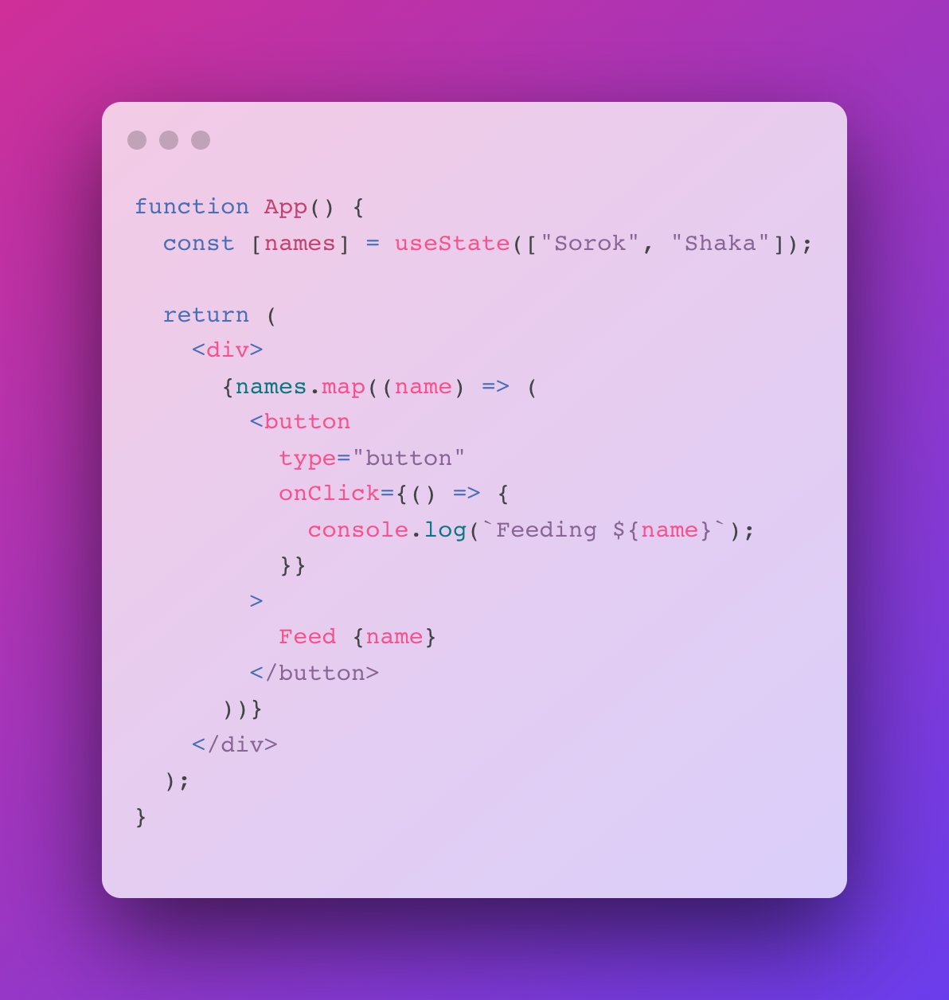
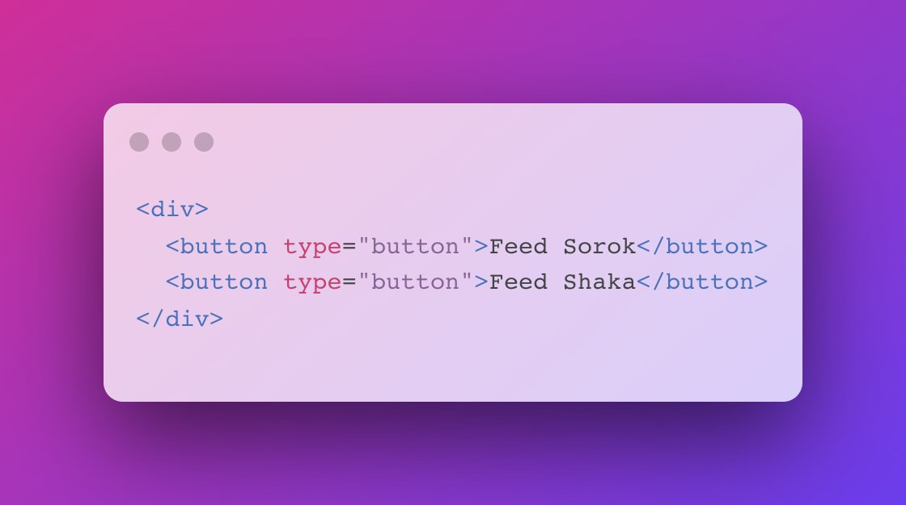

Server-side rendering (SSR) 과 hydration 에 대해서 간단히만 정리해볼게요. 혹시 틀린 내용이나 보충할 내용은 댓글 주시면 됩니다 :)

예를 들어 아래와 같은 React component 가 있다고 가정할게요. 대강 뭐 하는 컴포넌트인진 아시겠죠. 버튼 두개를 그리고, 버튼 누르면 로그 남기는 정도에요.

보통 client-side rendering 에서는, html 은 거의 빈 상태이고, 저 컴포넌트를 렌더링하기 위한 app.js 같은 파일이 로딩될 테고, 그런 후에 그려지겠죠. 다시 말해, 브라우저는 저 웹페이지 asset 들을 로딩하고 빈 화면이 아주 짧게 있은 후에 React 가 렌더링하고 나면 저 컴포넌트가 그려져요.

근데 이게 검색 엔진 최적화(SEO) 등의 이슈가 있어요. 태초(?)엔 모든 html을 당연스레 서버에서 렌더링했지만, 복잡한 클라이언트의 니즈가 생기면서 렌더링의 주체가 클라이언트로 한동안 옮겨갔다가, 이제는 다시 서버로 되돌리는 그런 움직임이라고 이해하셔도 좋을 것 같아요(역사적인 측면에서)

그래서 SSR 이 어떻게 돌아가냐면, 서버 사이드에서 저 컴포넌트를 렌더링하는 거죠. 그러면 아래와 같은 html 이 만들어지겠죠? 그럼 그걸 내려줘요. 그러면서 react, app.js 등을 같이 내려주는 거에요.

아까 onClick 같은 이벤트 핸들러를 붙여야 하잖아요. 그래서 `<React 는 서버에서 내려와서 이미 브라우저에 렌더링된 html 을 한번 쭉 살피는 거죠. app.js 에 있는 그 컴포넌트와 일종의 비교/대조를 거치며 일종의 React 관리 하에 두는 과정을 거쳐요. 이벤트 핸들러도 붙이고.>`

위 `<...>` 괄호 안의 과정을 hydration 이라 불러요.

https://mobile.twitter.com/eunjae_lee_ko/status/1538829233849393153